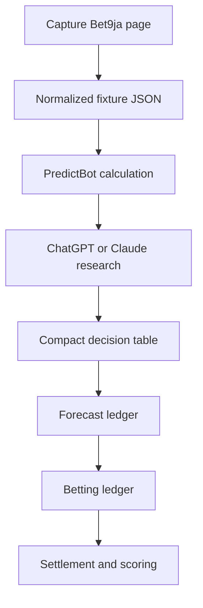

# Daily ledger workflow — for ChatGPT, Claude, and Gemini orchestration hosts

This replaces the old approach of pasting an entire Bet9ja page (or a full
prior session transcript) into a chat host and asking it to re-derive
everything from scratch. That approach produced internally contradictory
output — conflicting received/parsed counts, a candidate carrying two
different classifications in different sections, a jurisdictional-STOP
fixture still appearing in a ranked list a few paragraphs later, several
overlapping report versions pasted together — because nothing was ever
recorded between sessions. The ledgers exist to fix exactly that: every
forecast and every ticket is written down once, in one place, and never
silently duplicated or overwritten.



**This PR builds F, G, and H** (the two ledgers, their CLI, and scoring) —
never a universal parser for arbitrary pasted page text or old session
transcripts. Steps A-E (capture, normalization, running the calculation,
research, and the compact table) are today's manual work; a small capture
tool to automate step A is the next, separate piece of work once this
manual workflow is proven end to end (see this repo's README, "What
remains unbuilt").

## What normalized JSON means here

`ledgers.cli record-forecast` and `place-ticket` accept ONE JSON object
per fixture/ticket, matching `ledgers/forecast_ledger.py::build_recorded_event`
and `ledgers/betting_ledger.py::build_placed_event`'s own keyword
arguments — see `ledgers/examples/*.json` for real, working examples.
Never a copy-pasted page fragment, never a whole prior chat transcript.
If a source (Bet9ja, or a research host) hands you a big blob of text,
the normalization step (B above) is: extract exactly the fields the
schema needs, one JSON object per fixture, before anything touches the
ledger.

## The daily sequence

1. **Capture fixtures once.** Whatever source you're working from
   (Bet9ja page, a prior day's shortlist), read it exactly once per
   fixture. Assign one `batch_id` (e.g. `2024-08-17-morning`) to every
   fixture captured in this sitting — the batch is what ties the day's
   reconciliation together.
2. **Produce one normalized JSON file per fixture** (or a small script
   producing several) — `fixture_id`, `sport`, `league`, `kickoff_utc`,
   `market_type`, `offered_odds` (complete opposing prices), plus
   `batch_id`/`capture_id`/`source`/`captured_at_utc` so the record traces
   back to this capture session.
3. **Run PredictBot deterministically** against each fixture's odds
   (`pcbf-calculator`, or the research baseline directly) to get
   `model_probabilities` and the model/artifact/input/output hashes.
4. **Research only the shortlisted fixtures** — not every fixture in the
   batch. A fixture that hits a hard rule (jurisdictional STOP, market
   too thin, whatever your own criteria are) gets `stop_reason` set and
   `selection_status: "skipped"` — it is still recorded
   (`ledgers.cli record-forecast`), just excluded from anything ranked.
5. **Return one compact decision table**, not a long audit report. Every
   row is a candidate that survived step 4 (`ledgers.cli export-csv`'s
   `ranked_candidates.csv` already excludes STOP items structurally —
   never trust an ad hoc filter re-applied by hand each time):

   | Rank | Fixture | Selection | Odds | Model | Market | State | Reason |
   |---:|---|---|---:|---:|---:|---|---|
   | 1 | Example A v B | Home | 1.94 | 46% | 49% | RESEARCH | Model trails market |
   | 2 | Example C v D | Away | 2.20 | 48% | 43% | RESEARCH | Candidate for review |

   followed by exactly four totals (`ledgers.cli summary <batch_id>`
   prints these as one JSON object — never hand-assembled prose, never
   more than one summary per batch):

   - fixtures captured
   - fixtures rejected
   - candidates reviewed
   - records written (per ledger)

6. **Append every forecast to the forecast ledger**
   (`ledgers.cli record-forecast forecast.json`) — every candidate from
   step 2, STOP or not. Re-running the same JSON file is a safe no-op
   (idempotent re-import); a changed value under the same fixture/market/
   model triggers a refused conflict, never a silent overwrite.
7. **Append actual tickets to the betting ledger**
   (`ledgers.cli place-ticket ticket.json`) for whatever was actually
   staked, referencing each leg's `forecast_id`. Nothing is ever placed
   into the betting ledger that doesn't already have a forecast-ledger
   record — a ticket leg with no matching `forecast_id` is a data-entry
   mistake to fix, not something to paper over.
8. **Import results and score both ledgers separately** once matches
   finish: `ledgers.cli record-result <forecast_id> <H|D|A>` scores the
   forecast (Brier score, log loss, opening-vs-closing market
   comparison); `ledgers.cli settle-ticket <ticket_id> SETTLED
   --leg-results ...` computes the ticket's own return and profit/loss.
   These are two different numbers about two different things — a ticket
   can win money on a poorly-calibrated forecast, or lose money on a
   well-calibrated one — and this workflow never conflates them.
9. **Regenerate the CSV views** (`ledgers.cli export-csv`) whenever you
   want to look at the day's (or the running) ledger state in Excel.
   These files are always fully regenerated, never hand-edited, and
   never the source of truth — the JSONL ledgers are.

## The four invariants this workflow enforces

The old session's contradictions came from having no single source of
truth. The ledgers structurally rule each one out:

- **One canonical received/parsed count.** `ledgers.cli summary
  <batch_id>` computes `fixtures_captured` once, directly from the
  forecast ledger's own recorded state for that batch — never restated
  by hand, never two different numbers in two different places.
- **One classification per candidate.** Each forecast's `classification`
  is one field on one RECORDED event; there is no second location where
  a different value could be written.
- **STOP items structurally excluded from rankings.**
  `ledgers.summary.ranked_forecasts` (and the `ranked_candidates.csv`
  export it backs) drops every record with a non-null `stop_reason`
  before a caller ever sees it — a STOP-marked fixture cannot end up in
  a ranked table because a filter was forgotten somewhere downstream.
- **One generated operator summary per batch.** `daily_batch_summary`
  returns a single dict for a `batch_id`, computed fresh from the
  ledgers each time it's called — never several overlapping report
  versions appended together.

## What this workflow does not do (yet)

- No automatic Bet9ja scraping — step 1/2 above are manual (or your own
  script) until the small capture tool mentioned in this repo's README
  is built.
- No automatic model changes from settlement results — scoring a
  forecast never touches model weights, training, or registration.
- No staking recommendations — the ledgers record what you decided and
  what happened; they never tell you what to bet.
- No changes to `soccer_1x2`'s registration, classification, or
  promotion thresholds — every forecast recorded here stays
  `RESEARCH-MODEL` regardless of how it scores.

## Command reference

```bash
# One-time setup (creates ./ledger_data, gitignored)
python -m ledgers.cli init

# Record every forecast a batch produces (idempotent re-import)
python -m ledgers.cli record-forecast ledgers/examples/forecast_example.json
python -m ledgers.cli record-forecast ledgers/examples/forecast_example_stop.json

# Track the operator's own decision as it changes
python -m ledgers.cli update-selection <forecast_id> shortlisted
python -m ledgers.cli update-selection <forecast_id> placed --operator-decision STAKED

# Place a ticket referencing one or more forecast_ids
python -m ledgers.cli place-ticket ledgers/examples/ticket_example.json

# Once the match result is known
python -m ledgers.cli record-result <forecast_id> H --closing-odds '{"H":1.8,"D":3.5,"A":4.5}'

# Once the ticket settles
python -m ledgers.cli settle-ticket <ticket_id> SETTLED --leg-results '[{"leg_index":0,"outcome":"WON"}]'
python -m ledgers.cli settle-ticket <ticket_id> VOIDED --reason "bookmaker cancelled"
python -m ledgers.cli settle-ticket <ticket_id> CASHED_OUT --actual-return 15.0

# Inspect
python -m ledgers.cli validate
python -m ledgers.cli export-csv
python -m ledgers.cli summary 2024-08-17-morning
```
